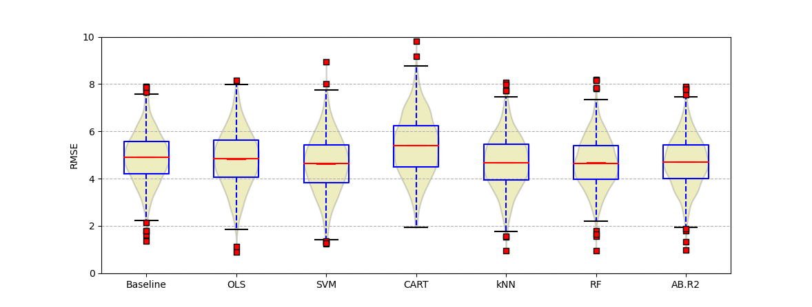
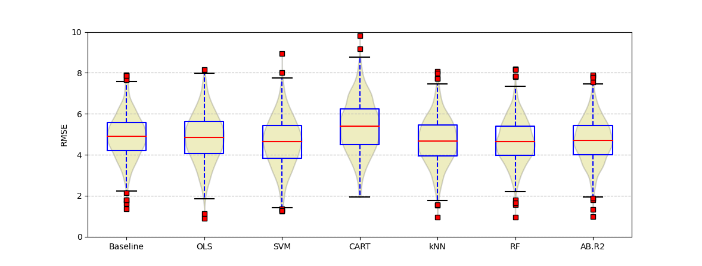
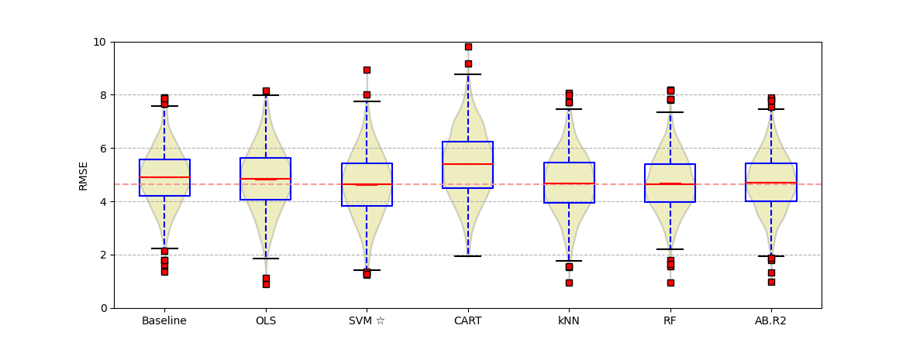
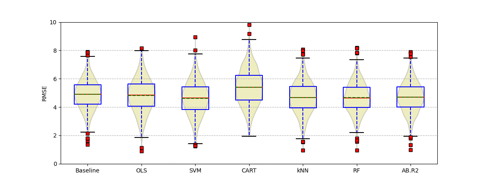
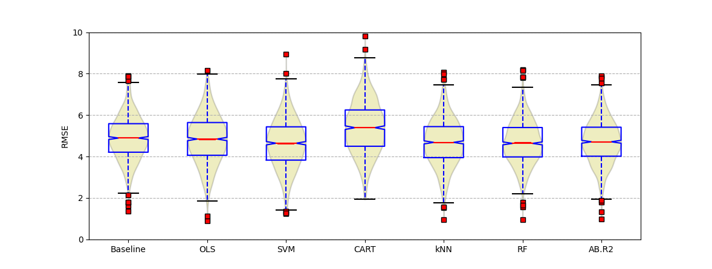
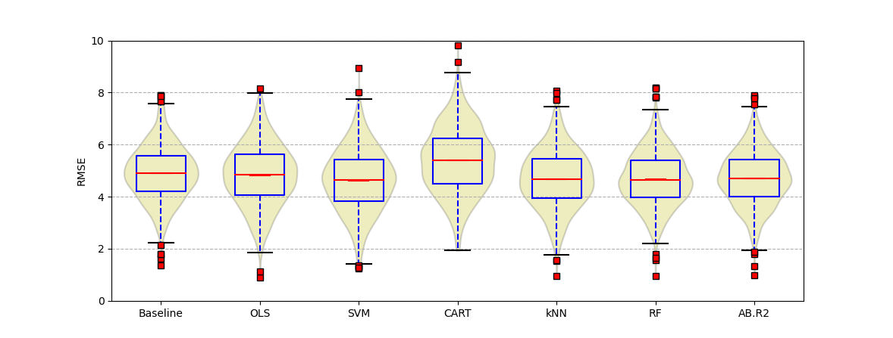
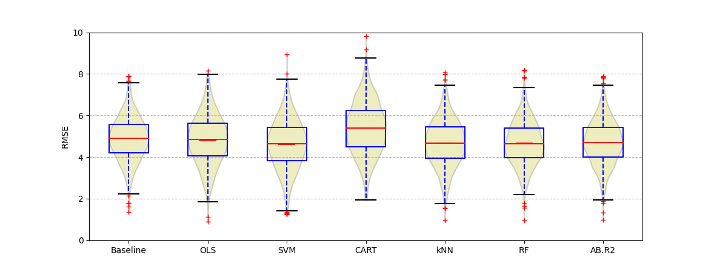
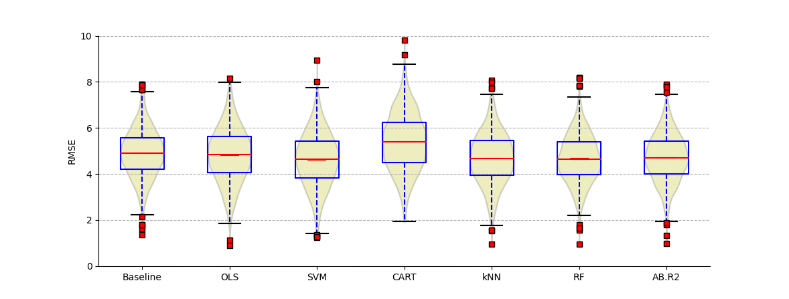
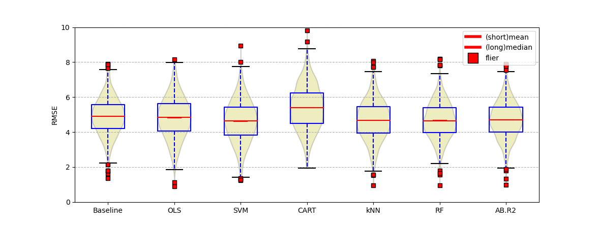
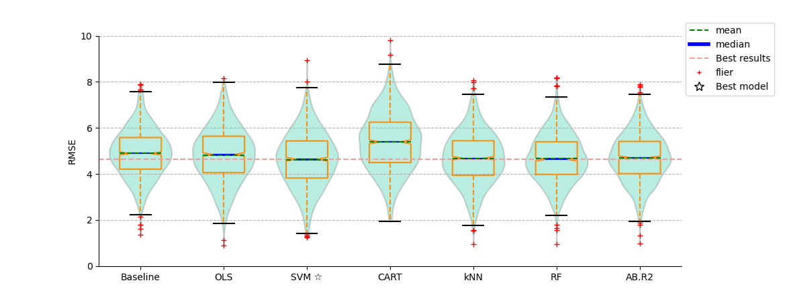

##1.	Abstract:

In this project, we analyzed an information visualization referred to a paper about classification and regression algorithms for modelling students’ academic performance. Researchers use the data sets from The University of Porto to build different models with different algorithms to predict the students’ performance in the courses. The graph we chose shows the distribution of RMSE values of models obtained by regression algorithms. We complete the program of the graph with Python Matplotlib and make some analysis and improvement on the graph according to the knowledge of information visualization which we have learned in this term.

##2.	Introduction:

For more and more people focus on the education field, the higher quality of education in the universities becomes one of the most important standards. The higher quality of the university education, the more talented people the universities will produce. And these graduates can draw on the knowledge they learn in various courses to make world better and better.
 	In order to guarantee most students don’t miss themselves in the university, it’s necessary and meaningful to do research for students’ academic performance. So we choose the paper “A Comparative Study of Classification and Regression Algorithms for Modelling Students’ Academic Performance” to improve the visualization.

##3.	Related work of the graph:

The graph combines a box chart with a violin chart. The x-axis is the name of each algorithm, and the y-axis represents the RMSE value of the model obtained by each algorithm. 
The lines in the box plot from top to bottom represents upper fence, Q1, median, average， Q3 and lower fence.(The two lines in the middle of the graph, longer one means median,shorter one means average ) And there are also some outliers in the graph which are little red squares. We can see that the lines of median and mean are always similar, which means that data distribution is concentrated and the degree of dispersion is low. 
The violin chart shows the distribution status and probability density of the data of different algorithms. In the violin chart ,the vertical axis represents the RMSE value of the model obtained by each algorithm, the horizontal axis representing the distribution of RMSE value in different values.
  The graph combines the characteristics of the box chart and the density chart. And it is mainly used to display the distribution shape of the data, which is better at the density level. As a result, we can see that KNN and RF have almost same size of the box plot. And all violin plots show exactly the same shape, i.e., equally sized upper and lower tails. Therefore, differences are more related to overall performance (i.e. location). 
In the end, we can conclude that SVM model is the best because the RMSE value of SVM model is smaller than any other models based on the baseline. In the graph, we can find some visual variables: position, size, shape, value, color and texture. 
And there may be cognitive tunneling when understanding the graph. The graph includes so much information like density of data distribution, outliers, median, means and so on. There may be information overload in the graph. When our brain focuses on a particular thing, we may ignore some important information like the density distribution of data. And we think the graph needs to provide a minimum amount of information to make sense of the issue and should consider the limitations of the working memory capacity.

##4.	Implementation

###4.1.	The graph used yellow and blue as the main color, which is not colorblind-friendly. So we decide use green color to fill up the violin graph and use the orange line to draw the box plot.

###4.2.	We have concluded that in the regression algorithm, SVM is the best model. We think we should mark the line for average value with a dotted line and mark the name of the best model with different signature(like star). 

###4.3.	Short lines and long lines is close and people cannot distinguish them easily. So we use lines with different length and different colors which is colorblind-friendly. 

###4.4.	People cannot judge whether the line of median is more close to Q1 or Q3. So we make the line of median much shorter than that of Q1 and Q3 so that people can judge by the angle of the edge and the line of median. 

###4.5.	We found that the edges of blue rectangle of boxes is overlapping with those of the violin plots and we cannot see the edges of violin plots exactly which represents the density distribution of data. So we made violin plots fatter.

###4.6.	The outliers which is red rectangle in the former graph is overlapping with each other and we think it’s hard to see the value of outliers exactly, which may have bad influences for the analyst and other people. So we change the represent of outliers to “+” so that we can see the outliers in the different points which is crossed by the “+”s. 

###4.7.	The border line of the above and right is redundant, which violate the cognitive theory. So we remove the two border lines.

###4.8.	We add the legend of what data every kind or color of line represents so that people can easily read the important data in the graph with many lines.

##5.	Result

